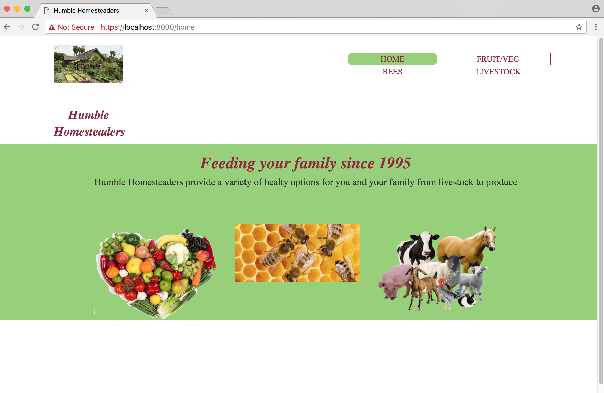
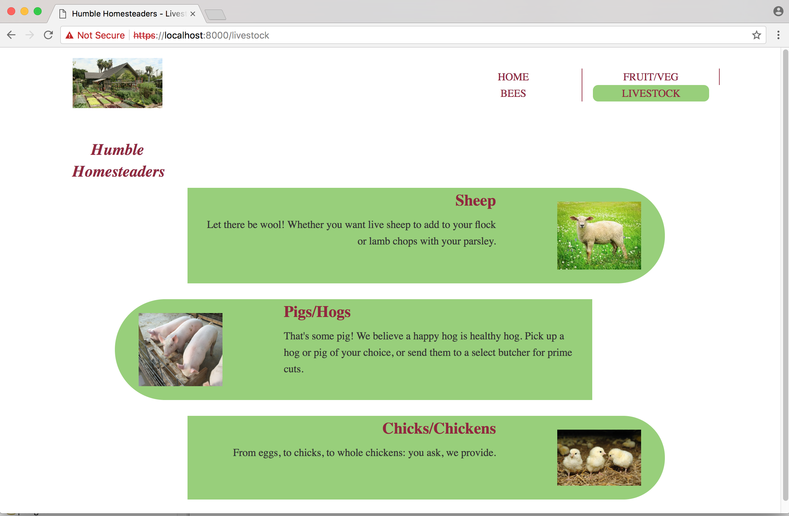
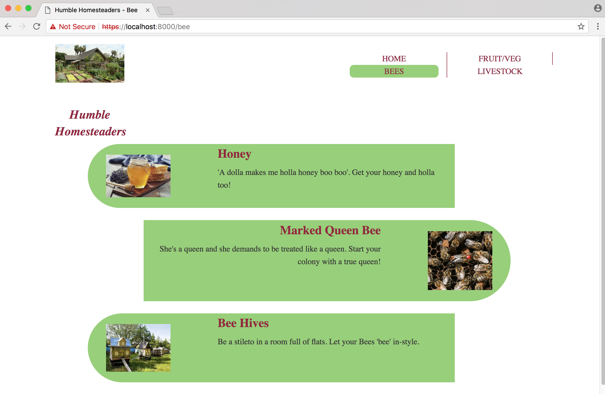
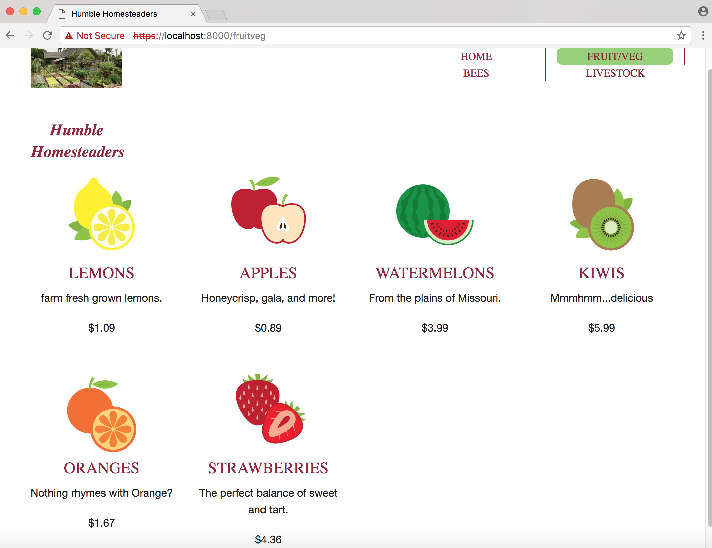
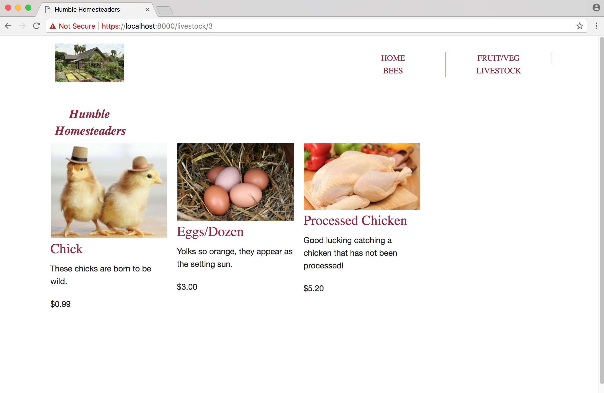

# go-mvc-web-development

This is soley to enhance skills in Go. Following topics leveraged:
 - middleware
 - templating
 - MVC pattern
 - handling HTTP requests
 - Unit testing in Go
 - basic db interaction

## Sample Pics of Site
### No Place Like Home

### I Want MOOO-RE

### Bee Fantastic!

### Fruits and Veggies

### Chickety Chickety Boom Boom

## To install local assets

* install NodeJs (https://nodejs.org)
* run `npm install` from the root directory of the project
- runt `grunt` from the root directory of the project

To run the application:

* run the following commands
 * `go install github.com/bfraz/webapp`
 * `src/webapp`

 (the app assumes a postgres db with a livestockproduct table containing 3 entries.
   Data entries can be found in the livestockProduct model)

## References
This was motivated by Pluralsight course, named Creating Web Applications with Go.
